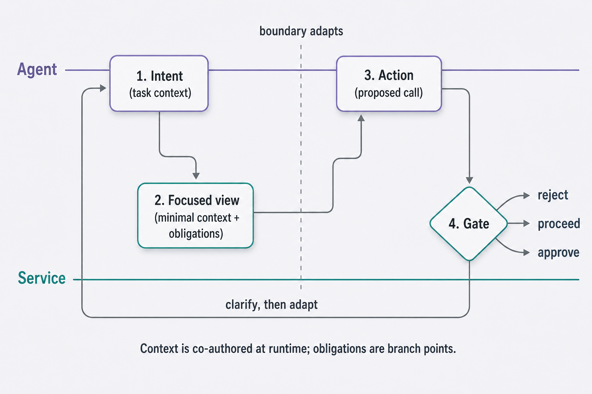
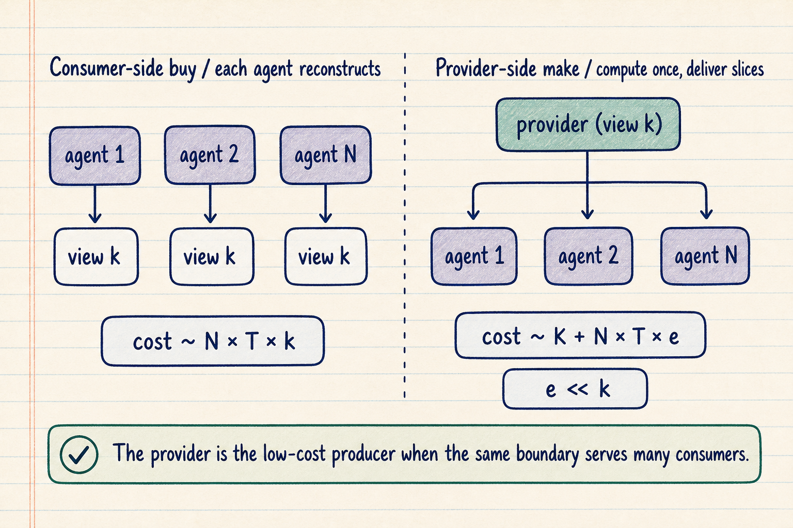
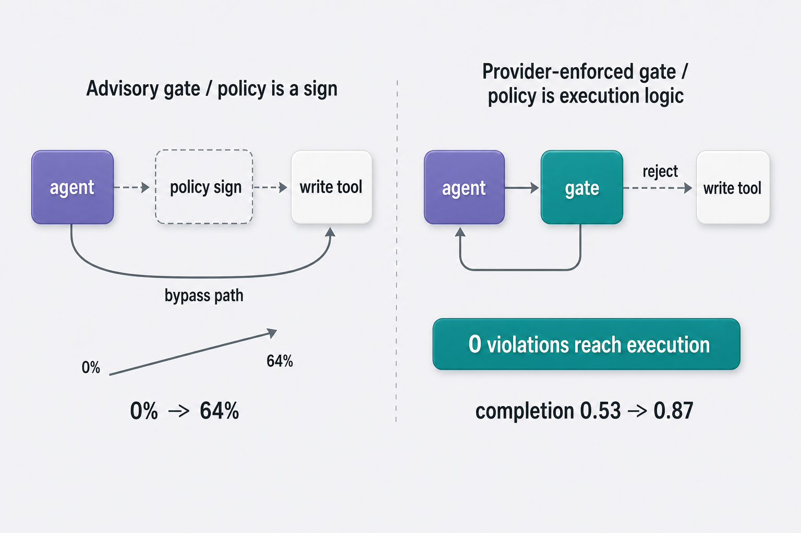
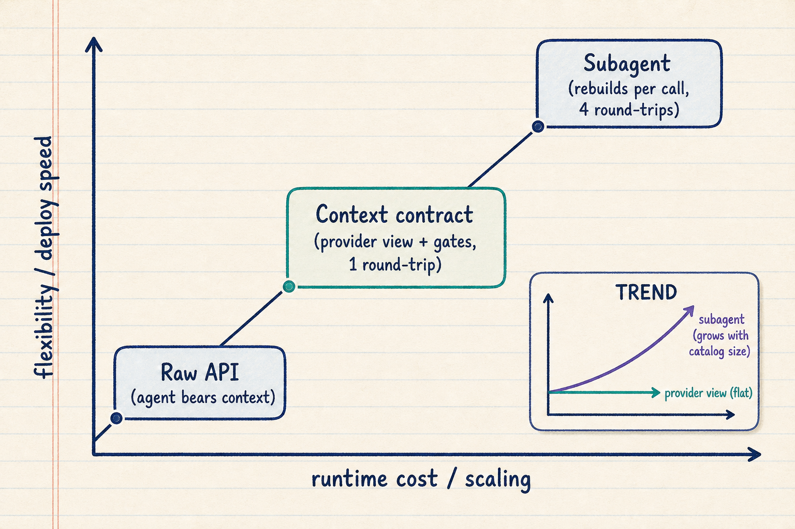

# Context-Boundary Optimization

**When a person uses a software service, the interface is an information
architecture.** It surfaces the relevant actions at each step, confirms the
risky ones, and records what happened. An autonomous agent calling the same
service through its API inherits none of that — only functions and types.

This project develops **context-boundary optimization**: the service computing,
per task and at runtime, the information architecture an agent needs. The
governing object is a **context contract**; its mechanism is a **fisheye view**
keyed to the current task rather than a static document.


## The argument in three parts

| | Question it answers | |
| --- | --- | --- |
| **A · Technical** | What is a context contract, and does one improve agent reliability? | [read →](papers/technical-paper.md) · [PDF](papers/context-boundary-optimization.pdf) |
| **B · Economic** | Who should compute the boundary, and why the provider? | [read →](papers/economic-paper.md) · [PDF](papers/computing-the-context-boundary.pdf) |
| **3 · Implementation** | How does a service team actually build one? | [browse →](library/) |

Paper A defines the framework and reports live experiments. Paper B makes the
transaction-cost case for provider-side computation and enforcement. Part 3
turns the framework into a small dependency-free library and a worked example,
so the papers describe something runnable rather than only a design.

## The idea, concretely

A service exposes forty API functions. An agent asked to *"refund the duplicate
charge on invoice 4471"* needs perhaps four of them, one obligation (a refund
over $500 requires supervisor approval), and one record format. Today it
receives all forty and a prompt hoping it infers the rest.

**A context contract makes that inference unnecessary.** The service computes a
task-scoped view, states the obligations that apply, and specifies the record it
expects back — then enforces the obligations deterministically rather than
trusting the model to remember them.


## The reference implementation

`context_contract` gives each construct in the papers a small Python object with
no dependencies.

```python
from context_contract import ContextContract, focused_view, Gate

contract = ContextContract.load("contract.json")
view     = focused_view(catalog, task, contract, k=4)   # the fisheye selection
verdict  = Gate(contract).check(action)                 # deterministic enforcement
```

Three ways to use it — an advisor agent that designs a contract for your
service, a CLI (`python -m context_contract advise | scaffold | check`), and a
[worked billing-service example](library/examples/billing-service/) carrying one
action the gate approves and one it rejects.

[**Browse the library →**](library/)

## Interactive

Three tools built while running the experiments, kept because they show the
mechanism better than prose does.

- [**Trace browser**](demos/trace-browser.html) — step through what an agent
  actually did, turn by turn
- [**Adjudication view**](demos/adjudication.html) — how a run was scored, and
  where scorers disagreed
- [**Plain-English results**](demos/plain-english-results.html) — the findings
  without the statistics

## Figures

<div style="display:grid;grid-template-columns:repeat(auto-fit,minmax(240px,1fr));gap:1rem">
  
  
  
  
</div>

## Status

**Both papers are working drafts.** The framework, the library and the worked
example are complete and runnable; the empirical claims are still being
strengthened, and the drafts are tagged accordingly. This site publishes the
work as it stands rather than waiting for a finished version.

Licensed MIT (code) and CC-BY (papers) — see [LICENSE](LICENSE).
