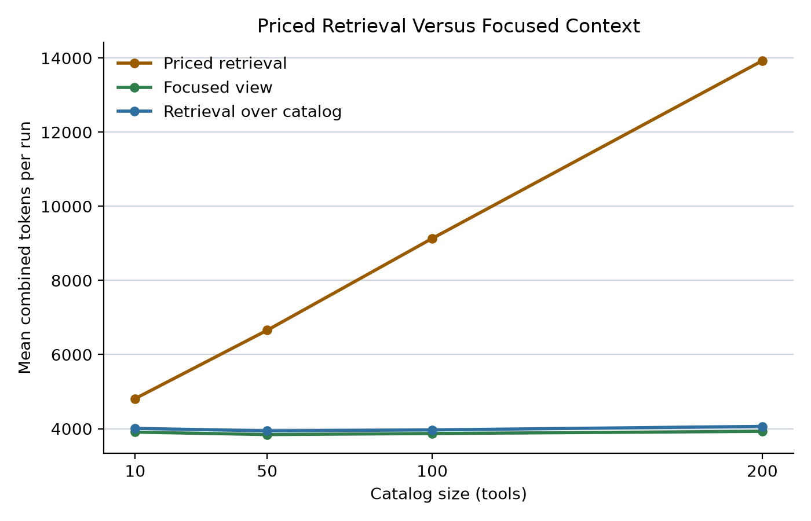

# Computing the Context Boundary: A Transaction-Cost Argument for Agent-Aware Services

Author: Fred Smalkin and collaborators

Status: working draft; statistics corrected 2026-07-12 to the four-task exact tests

> **Statistics corrected (2026-07-12).** This draft's legacy large-service, priced-retrieval, and subagent effects are now directional at the four-task exact-test floor rather than significant, and the overlay parity claim is reported as interval overlap rather than a margin test. The canonical, artifact-bound claim status is `docs/claims-registry.md`.

Version: 2026-07-10

## Abstract

Agent-consumed services create a recurring allocation problem: the provider, consumer, or intermediary must turn a broad service surface into a task-relevant policy and capability view. This paper argues that provider-side boundary computation can be the lower-cost arrangement when service knowledge is specialized and the resulting view is reused. The claim is conditional on policy size, reuse, maintenance cost, and the quality of consumer-side alternatives.

The strongest empirical anchor is a preregistered tau2-bench overlay. Against a tuned configuration that placed the full policy in the prompt, an integrated provider-supplied contract met the preregistered task-success parity criterion and reduced mean agent-side prompt tokens by 29.5 percent. The completed preregistered crossover is two-sided: agent context fell 52.1 percent on the largest overlay policy, rose 2.6 percent on the smallest, and increased by 4,413 paired prompt tokens [3,114, 5,694] on the small-schema Phase 5 database surface.

Legacy large-service experiments add harness-scoped cost evidence. Corrected profile-level analysis found that full-catalog exposure added 8,079 combined tokens relative to a focused view, with a 95 percent interval of [4,791, 11,632]. A priced two-call retrieval implementation also cost more than the focused view. The result applies to the tested designs; cached indexes, shared consumer infrastructure, and different retrieval designs remain open comparisons. The subagent suite preserves a token-cost result while its earlier capability-superiority claim falls back to grader-passing behavior.

Enforcement supplies a structural distinction and an authoring cost. Phase 5 quantified the authoring risk: a single mis-authored aggregation-floor rule drove the false-positive rate to 47.6 percent and reduced execution accuracy by 0.300, while false negatives remained zero. Provider-side contracts therefore combine a scale-dependent amortization opportunity with an enforceable boundary whose value depends on tested preconditions.

## 1. The Integration-Cost Problem For Agent-Consumed Services

An agent-facing service exposes operations, policy, and state. A consumer still has to identify the small slice relevant to a live task. That transformation creates two costs.

- Runtime assembly cost covers reading, selecting, and applying the service view for a task.
- Development cost covers integration logic, maintenance, and policy updates.

The technical companion defines the context contract and reports the executed evidence [12]. This paper asks where boundary-computation cost should reside.

Three parties can supply the boundary:

| Supplier | Comparative strength | Comparative risk |
| --- | --- | --- |
| Provider | Direct access to service policy and action semantics. | A provider contract can be stale, incomplete, or self-serving. |
| Consumer | Direct access to user goals and local workflow state. | Service-specific work repeats across integrations. |
| Intermediary | Shared infrastructure across providers and consumers. | Enforcement depends on control of the action path. |

The economic claim is an allocation proposition. Provider computation gains when provider-held knowledge is costly to reconstruct and the view is reused. Consumer or intermediary computation gains when local adaptation dominates or shared indexes make reconstruction cheap.

## 2. Runtime Assembly Cost And The Amortization Crossover

Let M denote service-policy size. Let k(M) be the cost of deriving a task-relevant view from the broad service surface. Let e(M) be the cost of applying a maintained view. Let K(M) be the provider's setup cost, and let U(M) be ongoing update cost.

For N consumers and T tasks per consumer, repeated consumer construction has approximate cost:

Consumer cost = N x T x k(M)

Provider delivery has approximate cost:

Provider cost = K(M) + U(M) + N x T x e(M)

Provider delivery has a cost advantage when reuse covers setup and maintenance:

N x T x [k(M) - e(M)] > K(M) + U(M)

The inequality states the crossover without assuming that k is always much larger than e. Small services, low reuse, or efficient cached consumer indexes can keep the left side small. Large policies and repeated calls increase the value of a maintained focused view.

The Phase 1b overlay supplies direct evidence for the policy-size term. Mean agent-side prompt tokens fell from 86,284 under full-policy prompting to 60,866 under the integrated contract, a 29.5 percent reduction. The largest-policy domain fell from 142,135 to 68,032, a 52.1 percent reduction. Retail fell by 5.0 percent, while airline rose by 2.6 percent. The overlay therefore measured a large-surface saving and a small-surface cost.

Phase 5 measured the other side under a separate preregistration. D2 predicted that the integrated contract would use fewer prompt tokens than a full schema dump. It came out otherwise: integrated used 14,788 mean prompt tokens against 10,375 for schema_dump, a paired increase of 4,413 [3,114, 5,694]. The mechanism was fixed contract structure adding 927 tokens plus one extra protocol turn that re-sent the system prompt. The contract pays on large surfaces and costs on small ones; both directions are now measured under preregistration.

Task-success parity matters to the cost interpretation. Integrated reward was 0.583 against a full-policy mean of 0.620 with a 95 percent interval of [0.500, 0.741]. The paired difference was -0.037 [-0.139, +0.065], which met the preregistered parity criterion. The overlay therefore measures a context-cost reduction under its stated success criterion rather than a trade of known success for lower token use.

The criterion remains bounded. It defined parity as the integrated mean falling inside the full-policy arm's bootstrap interval. A margin-based non-inferiority study could impose a stronger economic constraint on acceptable performance loss.

## 3. Consumer-Side Development Cost And The Labor Shift

Runtime tokens expose only part of boundary cost. Consumer teams also build service-specific integration artifacts.

| Consumer work | Provider-held input |
| --- | --- |
| Capability selection | Service hierarchy and operation semantics |
| Approval logic | Action effects and policy preconditions |
| Evidence handling | Source structure and freshness rules |
| State orchestration | Service transitions and stop conditions |
| Maintenance | Release changes and policy revisions |

A provider-maintained context contract can convert this internal knowledge into a stable integration surface. Each consumer still supplies user intent and local state. The provider supplies the service-specific structure that every consumer would otherwise reconstruct.

Total integration labor has not been measured in this program. Phase 5 quantifies one part of provider authoring cost: a malformed precondition can convert directly into rejected legitimate work and lower execution accuracy. A complete comparison still needs provider authoring, consumer integration, and intermediary maintenance. Cached retrieval and shared indexes belong in that comparison because those designs can amortize consumer-side work.

## 4. Make Or Buy: The Transaction-Cost Argument

Coase treats organizational boundaries as a comparison between internal coordination cost and repeated market transaction cost [4]. Context-boundary computation fits that frame. The activity can be performed inside the service organization, repeated by every consumer, or purchased from an intermediary.

Williamson adds asset specificity and transaction frequency [14]. Provider-side computation gains when the required knowledge is specific to the service and the transformation repeats across calls. Consumer-side computation gains when the view depends mainly on local workflow knowledge. Intermediaries gain when they can reuse normalized service maps across a market.

The provider case is strongest under the following conditions:

- policy and capability surfaces are large
- protected actions require service-specific semantics
- the same boundary view serves repeated tasks

The consumer case is strongest under a different set:

- service scope is small
- task adaptation is highly local
- consumer infrastructure already maintains an efficient index

These conditions make the theory falsifiable. A general provider superiority claim would require measured costs across the three supply arrangements.

## 5. Public-Good Incentives And Enforcement

Consumer-built service maps create spillovers. A maintained map can help other consumers, while the original builder captures only part of that value. This incentive can leave shared boundary infrastructure underprovided.

Providers capture more of the service-wide return from lower integration friction. They also control policy changes and action semantics. Consumer verification remains necessary because provider declarations can be incomplete or stale.

Intermediaries can solve part of the coordination problem. Shared registries and wrapper platforms spread construction cost across customers. Their authority depends on where they sit in the execution path.

Enforcement is the structural boundary. An advisory contract influences agent behavior. A gate that fully mediates a protected service action can reject a call when a declared precondition is absent. The rejection guarantee follows from mediation and deterministic checking. Its usefulness depends on complete and correctly authored policy.

Phase 5 preregistered the authoring-risk test in D5 and reported the result even though it ran against the prediction.

| D5 component | Preregistered target | Observed result |
| --- | --- | --- |
| False negatives | Zero | Zero; no violating query reached execution |
| False positives | At or below 5 percent | 107 of 225 non-violating queries, or 47.6 percent |
| Enforcing accuracy | Interval includes zero or favors enforcing | Enforcing minus observe-only was -0.300 [-0.442, -0.167] |

One mis-authored aggregation-floor rule caused 102 of the 107 false positives. The rule required aggregate results to return at least five rows, although COUNT, SUM, and AVG queries return one row by construction. Excluding that rule leaves 5 of 225 false positives, or 2.2 percent, inside the preregistered ceiling. The gate also caught four genuine canary-touching queries and maintained zero false negatives.

A provider gate's guarantee is only as strong as its authored preconditions. Rule-authoring quality is the enforcement risk in this experiment; the deterministic mechanics worked on all four genuine canary cases. The 0.300 accuracy loss illustrates the authoring-cost leg of the enforcement argument for one defect, not a measured authoring-labor cost.

Provider ownership is one route to service-boundary enforcement. A delegated intermediary can also enforce when the provider authorizes it to mediate the call. The economic distinction is control of the boundary rather than the organizational label alone.

## 6. Market-Structure Prediction

The theory predicts that broader services will package more task-scoped policy and capability structure for agent consumers. Consumer effort per task should fall when reuse and policy size pass the crossover.

Observable signals include:

- focused service views alongside broad catalogs
- less service-specific prompt logic in consumer integrations
- intermediary products centered on compatibility and verification

MCP can carry this arrangement [12]. The protocol standardizes discovery and invocation. The economic question is which party computes the task-scoped service view and which party controls enforcement.

## 7. Empirical Evidence

### 7.1 Tuned-Frontier Overlay

The overlay is the strongest amortization evidence because it compares executed tasks under the same frozen sample, trials, agent model, and simulator. The full-policy arm represents the tuned prompt-stuffed configuration. The integrated arm supplies a focused contract.

| Metric | Integrated contract | Full policy | Economic reading |
| --- | ---: | ---: | --- |
| Native reward | 0.583 | 0.620 [0.500, 0.741] | Preregistered parity criterion met |
| Mean prompt tokens | 60,866 | 86,284 | Integrated lower by 29.5 percent |
| Largest-policy prompt tokens | 68,032 | 142,135 | Integrated lower by 52.1 percent |

The domain pattern is the empirical crossover. Savings were material on the largest policy and close to zero on the smaller policies. The result supports scale-dependent amortization rather than a universal per-call saving.

The overlay also constrains capability claims. The grader-flagged epistemic failure count ran against the integrated arm under both independent graders. Auditability favored integrated, and its authority and sensitive-exposure axes remained clean. The technical paper reports the low inter-grader kappa and the mechanism-probe classifications [12].

### 7.2 Database-Domain Crossover And Enforcement

Phase 5 executed 840 preregistered runs on the BIRD dev benchmark [15] across six packaging arms and an enforcing arm. D1 predicted packaging parity overall and an integrated advantage on the large-schema stratum. The integrated advantage did not appear: packaging-arm execution accuracy ranged from 0.392 to 0.433, with no Holm rejection.

| Outcome | Prediction | Reported result | Economic reading |
| --- | --- | --- | --- |
| D2 prompt cost | Integrated lower than schema_dump | Paired difference +4,413 [3,114, 5,694] | Fixed contract and protocol cost exceeds the full surface on small schemas |
| D3 canary exposure | Integrated below every baseline | Zero in final SQL for every arm; four intermediate gate catches | Final-answer privacy sits at an unmeasurable floor |
| D4 audit return | Best lineage discipline | 100 percent deterministic coverage and field completeness; rubric half deferred | The dedicated tool channel made audit return complete in this run; lineage quality remains unmeasured |
| D5 enforcement | Zero false negatives, false positives at or below 5 percent, and no accuracy loss | Zero false negatives, 47.6 percent false positives, and -0.300 accuracy | One rule-authoring defect dominated enforcement cost |

BIRD dev has been public since 2023 and falls inside the agent model's training window. Memorization plausibly compresses the value of condition packaging. Its small schemas also place the experiment on the cost side of the crossover. The result scopes the amortization claim to surfaces large enough for avoided reconstruction to exceed fixed contract and protocol cost.

### 7.3 Large-Service Catalog Instrumentation

The legacy large-service suite used synthetic catalogs and single-turn model responses. It has four unique semantic tasks, so corrected analysis treats the task as the unit of independence; the exact sign-flip floor is 0.0625 and the effects below are directional rather than significant.

| Contrast | Profile-level effect and interval | Exact-test verdict |
| --- | --- | --- |
| Tokens, full catalog minus focused | +8,079 [4,791, 11,632] | Weakens; directional at the four-task floor |
| Completion, focused minus full catalog | +0.263 [0.088, 0.450] | Weakens; directional at the four-task floor |
| Tokens, retrieval minus focused | +106 [-23, 220] | Falls |
| Completion, focused minus retrieval | -0.088 [-0.200, 0.000] | Falls |

The first two contrasts support focused delivery over full-catalog exposure inside this instrument. The retrieval contrasts estimate differences without a preregistered equivalence margin. Retrieval had the higher completion point estimate, so the free-retrieval run leaves the provider-versus-consumer selection question open.

### 7.4 Priced Retrieval Instrumentation

The priced follow-up charged the consumer for a two-call retrieval implementation. The profile-level token difference, priced retrieval minus focused, was +4,745 [3,143, 6,461], and focused completion exceeded priced retrieval by 0.225 [0.063, 0.400]. Under the four-task exact test both effects are directional at the 0.0625 floor; the earlier sub-0.001 values treated catalog sizes crossed with tasks as independent units and are invalid.

Priced-retrieval means increased from 4,812 [4,390, 5,212] at the smallest catalog to 13,926 [13,502, 14,382] at the largest. The provider-delivered arm was cheaper under this implementation.

This pair supports a result for one full-catalog model-retrieval design. Cached indexes, metadata search, and shared retrieval services could change the allocation.

### 7.5 Subagent Cost Instrumentation

The subagent suite used a multi-call reasoning loop over the synthetic catalog. Every recorded response passed the suite's grader. That result describes the instrument and does not establish executed-task capability.

Subagent combined tokens increased from 16,192 at the smallest catalog to 34,552 at the largest. The paired subagent-minus-focused effect was +20,041 [16,810, 23,542], directional at the four-task exact-test floor rather than significant.

The suite therefore identifies a cost tradeoff for this consumer-side reasoning design. General capability ranking requires executed tasks across raw catalogs, provider contracts, and subagents.

## 8. Implications For Platform Strategy, Pricing, And Standards

Service teams should treat the agent-facing boundary as a maintained product surface when policy size and reuse justify it. The overlay suggests that the return grows with policy size. Small services may remain below the crossover.

Pricing can reflect reduced integration and runtime cost only after those savings are measured for real consumers. Token savings are one component. Authoring, verification, and maintenance complete the cost account.

The Phase 5 gate failure makes verification a priced part of provider supply. Rule suites need semantic review and deterministic canaries before their enforcement guarantee has economic value. A single malformed precondition can erase the capability benefit the gate is meant to protect.

Standards can separate portability from ownership. MCP and related interface standards can carry task-scoped views. Contract provenance and versioning let consumers verify the provider's declaration. A delegated enforcement point can preserve the boundary guarantee for a provider that outsources the gateway.

The reference implementation in the technical companion demonstrates the artifact and gate mechanics [12]. It is a prototype for measuring adoption cost rather than evidence of production economics.

## 9. Related Work

The argument combines transaction-cost economics with platform boundary-resource research and interface design.

Coase supplies the make-or-buy frame [4]. Williamson adds asset specificity and transaction frequency [14]. These theories motivate the allocation test without predetermining the winner.

Platform research treats interfaces as governed boundary resources [5][6][13]. API access can shift innovation toward external developers [2][3]. A context contract adds a task-scoped agent surface to that literature.

Ecosystem and two-sided-market research explains why platforms may absorb integration cost to expand complementor value [7][11]. The prediction here concerns context assembly and service-policy maintenance.

Classic interface design emphasizes information hiding and behavioral contracts [9][10]. Modularity connects stable interfaces to economic value [1]. The law of least knowledge limits caller dependence on provider structure [8]. The focused view applies these principles to a runtime agent task, and the technical companion supplies the seven-dimension contract model [12].

## 10. Limitations

The economic argument is analytic. The program has not measured provider authoring labor, consumer integration labor, or intermediary maintenance.

The overlay uses one agent model and three tau2 domains. Its parity criterion is weaker than a margin-based non-inferiority test. Domain-level cost results show a large saving on one policy, a modest saving on another, and a cost on the smallest.

The Phase 5 database domain is BIRD dev, which has been public since 2023 and plausibly falls inside the agent model's training data. Its schemas are small. The flat execution-accuracy result may therefore reflect memorized structure, while the token result identifies the small-surface side of the crossover.

Canary exposure was zero in final SQL for every Phase 5 arm. At that floor, D3 provides no privacy ranking. The four intermediate gate catches are the only evidence of canary pressure.

The deterministic half of D4 establishes audit-channel coverage and field completeness. The dual-grader lineage-rubric half is deferred, and this paper makes no Phase 5 lineage-quality claim.

The large-service, priced-retrieval, and subagent suites are synthetic instruments. They use model-graded, single-turn responses without service execution. Corrected statistics preserve token effects and scope completion results to the harness.

The free-retrieval comparison did not test equivalence. The priced arm used a specific full-catalog model retrieval step. Consumer caches, shared indexes, and metadata search remain live alternatives.

The subagent suite establishes high grader pass rates and high token cost inside its instrument. It does not establish superior capability on executed tasks.

The D5 false-positive result is dominated by one mis-authored aggregation rule. It quantifies the cost of that defect and shows correctly authored canary checks working. Estimates of authoring-defect prevalence and labor cost require evidence across providers.

Provider contracts can be stale or self-serving. Consumers need provenance, versioning, and fallback access to broader service views. These governance costs belong inside the transaction-cost comparison.

The market-structure and pricing predictions require field evidence. Adoption data and measured integration budgets would test whether providers, consumers, or intermediaries occupy the lowest-cost position in practice.

## References

1. Baldwin, C. Y., & Clark, K. B. (2000). *Design Rules, Volume 1: The Power of Modularity*. MIT Press. ISBN 978-0-262-02466-2.
2. Benzell, S. G., Hersh, J., & Van Alstyne, M. (2024). *How APIs Create Growth by Inverting the Firm*. Management Science, 70(10), 7120-7141. DOI:10.1287/mnsc.2023.4968.
3. Boudreau, K. J. (2010). *Open Platform Strategies and Innovation: Granting Access Versus Devolving Control*. Management Science, 56(10), 1849-1872. DOI:10.1287/mnsc.1100.1215.
4. Coase, R. H. (1937). *The Nature of the Firm*. Economica, New Series, 4(16), 386-405. DOI:10.1111/j.1468-0335.1937.tb00002.x. https://onlinelibrary.wiley.com/doi/full/10.1111/j.1468-0335.1937.tb00002.x
5. Eaton, B., Elaluf-Calderwood, S., Sorensen, C., & Yoo, Y. (2015). *Distributed Tuning of Boundary Resources: The Case of Apple's iOS Service System*. MIS Quarterly, 39(1), 217-243. DOI:10.25300/MISQ/2015/39.1.10.
6. Ghazawneh, A., & Henfridsson, O. (2013). *Balancing platform control and external contribution in third-party development: the boundary resources model*. Information Systems Journal, 23(2), 173-192. DOI:10.1111/j.1365-2575.2012.00406.x.
7. Jacobides, M. G., Cennamo, C., & Gawer, A. (2018). *Towards a theory of ecosystems*. Strategic Management Journal, 39(8), 2255-2276. DOI:10.1002/smj.2904.
8. Lieberherr, K. J., & Holland, I. M. (1989). *Assuring Good Style for Object-Oriented Programs*. IEEE Software, 6(5), 38-48. DOI:10.1109/52.35588.
9. Liskov, B., & Zilles, S. (1974). *Programming with Abstract Data Types*. ACM SIGPLAN Notices, 9(4), 50-59. DOI:10.1145/942572.807045.
10. Parnas, D. L. (1972). *On the Criteria To Be Used in Decomposing Systems into Modules*. Communications of the ACM, 15(12), 1053-1058. DOI:10.1145/361598.361623.
11. Rochet, J.-C., & Tirole, J. (2003). *Platform Competition in Two-Sided Markets*. Journal of the European Economic Association, 1(4), 990-1029. DOI:10.1162/154247603322493212.
12. Smalkin, F., & collaborators. (2026). *Context-Boundary Optimization for Agent-Aware Services*. Companion technical paper, working draft, `drafts/technical-paper.md`.
13. Tiwana, A., Konsynski, B., & Bush, A. A. (2010). *Platform Evolution: Coevolution of Platform Architecture, Governance, and Environmental Dynamics*. Information Systems Research, 21(4), 675-687. DOI:10.1287/isre.1100.0323.
14. Williamson, O. E. (1979). *Transaction-Cost Economics: The Governance of Contractual Relations*. Journal of Law and Economics, 22(2), 233-261. DOI:10.1086/466942. https://www.journals.uchicago.edu/doi/10.1086/466942
15. Li, J., Hui, B., Qu, G., Yang, J., Li, B., Li, B., Wang, B., Qin, B., Geng, R., Huo, N., Zhou, X., Ma, C., Li, G., Chang, K. C. C., Huang, F., Cheng, R., & Li, Y. (2023). *Can LLM Already Serve as A Database Interface? A BIg Bench for Large-Scale Database Grounded Text-to-SQLs*. NeurIPS 2023. arXiv:2305.03111. https://arxiv.org/abs/2305.03111
