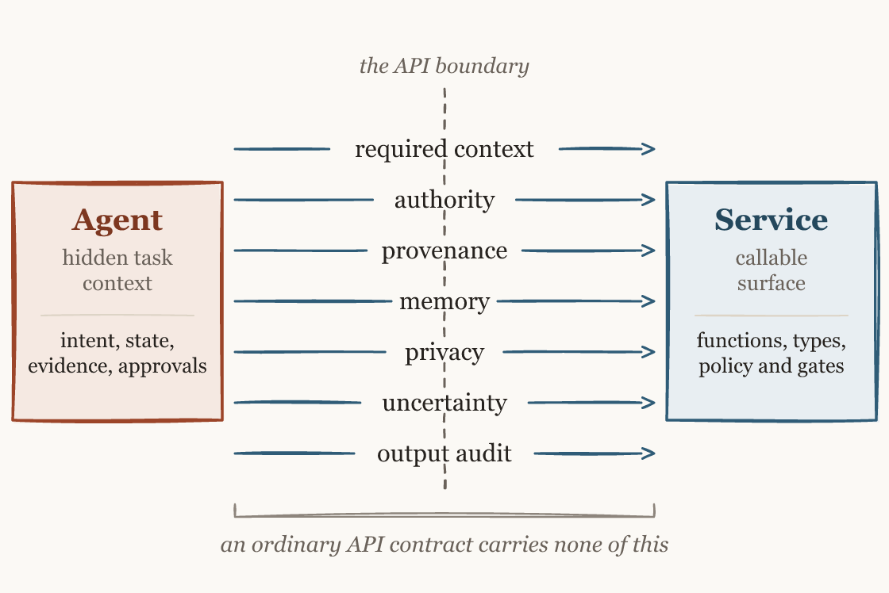
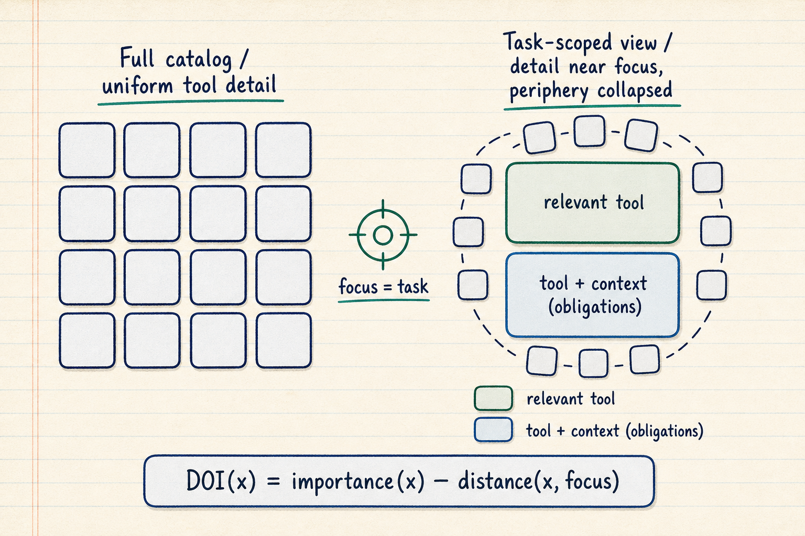
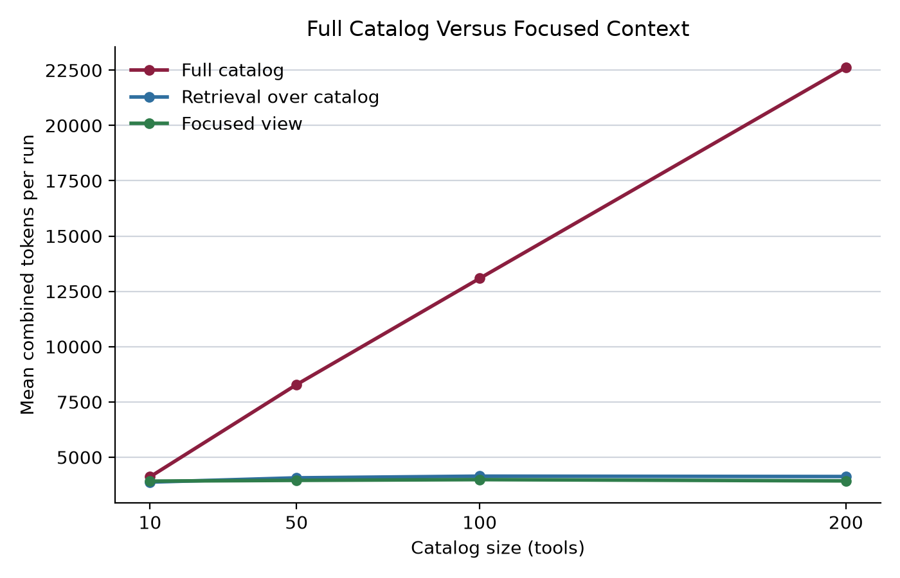

# Context-Boundary Optimization for Agent-Aware Services

Author: Fred Smalkin and collaborators

Article status: working paper; statistics corrected 2026-07-12 to the post-inference-fix analysis

> **Statistics corrected (2026-07-12).** This draft now matches the post-2026-07-10 inference correction: one native-reward Holm survivor (approval-only); auditability surviving three of five under the strict joint correction and all five in both legacy grades under exact tests; legacy large-service effects directional at the four-task floor. The canonical, artifact-bound claim status is `docs/claims-registry.md`; the regenerated analyses are `experiments/*/analysis-full.json` and `experiments/legacy-stats/legacy-stats.json`. The keystone's information-asymmetry limitation still bounds its causal reading (see Limitations).

Version: 2026-07-10

## Evidence Note

This article separates executed-task evidence from development instrumentation.

The primary evidence is the preregistered Phase 1 tau2-bench keystone. The run executed 648 traces across six conditions derived from one deterministic task-policy view. Conditions changed the agent-facing policy package while the task, user simulator, tools, reward policy, and seed schedule stayed fixed. Native state-based reward supplies the primary task-success measure. Grok 4.5 graded every normalized trace, and Claude Sonnet 5 graded a preregistered stratified half for the secondary boundary rubric.

The Phase 1b overlay supplies the tuned-frontier comparison. It pairs the keystone integrated arm with a full-policy, leaderboard-style arm on the same frozen tasks and trials. The overlay measures task-success parity and agent-side prompt cost when the baseline already carries the complete domain policy.

The Phase 5 database-domain experiment supplies a preregistered second-domain test. It executed 840 BIRD dev runs across six packaging conditions and an enforcing arm. Its deterministic outcomes cover execution accuracy and prompt cost, with separate canary, audit-return, and gate readouts. The dual-grader lineage-rubric half is deferred and supports no claim.

The earlier 210-run prompt suite and the large-service experiments remain useful instrumentation. Their corrected profile-level analyses support claims about prompt-and-grader behavior and harness-scoped cost patterns. Executed service outcomes and a general provider-versus-consumer comparison require other evidence.

Literature claims use the references below and the verified novelty analysis in docs/novelty-boundary.md. No single boundary dimension is claimed as new.

## Abstract

Agent-aware services must decide which policy, state, evidence, and authority information crosses the service boundary for a task. This paper defines context-boundary optimization and a context contract: a provider-owned, versioned artifact that computes a task-scoped view, evaluates obligations across seven boundary dimensions, and returns the audit record the artifact requires. The contribution is the coordinated service-boundary object rather than any individual mechanism.

A preregistered tau2-bench experiment executed 648 traces across six agent-facing policy packages. All packages came from one deterministic task-policy view, and native state-based reward scored task success. The integrated condition had the highest mean reward, 0.583 with a 95 percent interval of [0.481, 0.685]. Under a valid sign-flip test its advantage over approval-only survived Holm correction, while the other four comparisons remained directional. The integrated and orchestration arms carried extra simulator state that the other arms did not, so this native-reward effect is descriptive rather than a packaging-only causal result. A tuned-frontier overlay compared the same integrated arm with the full-policy configuration. The integrated arm held task-success parity and reduced mean agent-side prompt tokens by 29.5 percent.

The preregistered cost evidence completes a two-sided crossover: the contract reduced agent context by 52.1 percent on the largest overlay policy, increased it by 2.6 percent on the smallest, and added 4,413 paired prompt tokens [3,114, 5,694] on the small-schema Phase 5 database surface. Phase 5 also quantified enforcement authoring risk: a single mis-authored aggregation-floor rule drove the false-positive rate to 47.6 percent and reduced execution accuracy by 0.300, while false negatives remained zero.

Auditability was the stable cross-generation effect. Both independent graders ranked the integrated condition first; three of five comparisons survived the stricter joint family correction, and all five survived in both legacy grades under exact tests. The integrated condition recorded zero authority violations and zero sensitive-exposure events under both graders. The preregistered prediction of fewer total grader-flagged failures failed in both regimes. Binary any-failure agreement between graders was kappa 0.227. A mechanism probe classified 64 of the integrated arm's 73 flags as blinding artifacts or grader-simulator divergence and 9 as true failures.

The evidence supports a surface-dependent account. Interface packaging is associated with executed task success on held-out tasks with large policy surfaces and produced parity on the public, small-schema database surface. The contract saved context on large surfaces and imposed context cost on small ones. Auditability remains the strongest cross-generation result.

## 1. Introduction

An agent can satisfy an API schema and still fail the user's task. The call may omit a required policy fact, rely on unsupported state, or cross an authority boundary. A service can also expose so much policy and capability detail that the agent pays repeated context cost to reconstruct the task-relevant slice.

These failures arise at the context boundary: the task-level information and obligations that accompany a service call. A context contract makes that boundary explicit. It declares the context the service requires, the context it rejects, and the evidence the interaction must return.

Context-boundary optimization selects a task-scoped contract under competing goals. The contract should preserve task success, contain context cost, and make boundary decisions reviewable. The service and the agent hold different parts of the required information, so the boundary is bilateral. The agent supplies the live goal. The provider supplies its policy structure and action constraints.

The completed evidence supports a surface-dependent account:

| Regime | Primary result |
| --- | --- |
| Held-out policy packaging | Six packages derived from one task-policy view produced different native task outcomes. The integrated package ranked first, with one Holm-surviving pairwise advantage (over approval-only) and four directional comparisons, under a known information asymmetry between arms. |
| Tuned full-policy frontier | The integrated arm held task-success parity. Prompt cost fell on the largest policy and rose on the smallest. |
| Public small-schema database | Six packaging conditions produced execution-accuracy parity. Fixed contract structure and an extra protocol turn imposed a prompt-token cost. |
| Deterministic enforcement | The gate caught every genuine canary violation. One mis-authored rule dominated false positives and imposed a capability tax. |

The paper makes four contributions:

| Contribution | Scope |
| --- | --- |
| Boundary model | Seven dimensions for task context and obligations at an agent-service crossing. |
| Contract artifact | One provider-owned, versioned object for task scoping, joint obligation evaluation, and prescribed audit return. |
| Executed evidence | Preregistered tau2-bench packaging and overlay runs plus a BIRD database run. |
| Instrumentation record | Corrected legacy statistics that preserve useful cost evidence and retire unsupported capability claims. |

The companion economic paper develops the amortization and enforcement case for provider participation [28]. Appendix B maps the technical constructs to the repository's reference implementation.

### MCP And Context-Boundary Optimization

The Model Context Protocol standardizes how agent applications discover and call external tools, resources, and prompts [14][15]. OpenAPI and function calling provide related operation and schema surfaces [19][22]. These mechanisms can carry a context contract.

The residual contribution sits at the coordination layer. Existing mechanisms can express individual dimensions through schemas, retrieval, approval middleware, workflow state, or service code. A context contract gives the provider one versioned artifact that computes the task-scoped view, evaluates the dimensions together at the service boundary, and returns the audit record prescribed by that artifact.

Runtime gating alone is established prior art. Trace-based assurance contracts gate proposed actions before execution through deployer-authored predicates over orchestration traces [29]. The distinction here rests on provider ownership, runtime task scoping, joint cross-dimension evaluation, and contract-mandated audit return.

### Bilateral Context Engineering

Context engineering treats model input as a selected and budgeted resource [1][7][11]. Agent runtimes usually control the prompt surface. Service providers hold complementary information: their capability hierarchy, policy structure, and action preconditions.

A bilateral boundary combines the agent's task focus with the provider's service knowledge. The agent identifies the live goal. The provider computes the relevant service view and exposes the obligations that govern the next crossing. The arrangement reduces repeated reconstruction while preserving a path to broader context when the task changes.

### A Fisheye Principle For Focused Context

Furnas's generalized fisheye view allocates a bounded display according to an item's importance and distance from the current focus [6]. The same principle applies to an agent-facing service surface. A task-scoped view keeps detailed policy and capability information near the live goal while compressing the periphery.

The service owns the structural half of that computation. It knows which actions are related, which preconditions matter, and which policy sections govern the task. The agent supplies the current focus. A context contract carries the resulting view and its obligations.

## 2. Related Work And Novelty Boundary

Existing systems cover much of the boundary when assembled.

| Mechanism | Native strength | Remaining coordination work |
| --- | --- | --- |
| MCP, OpenAPI, function calling, and structured outputs [15][16][17][19][21][22] | Callable operations, typed arguments, and connection surfaces. | Task-state sufficiency and joint boundary obligations remain service policy. |
| RAG and Self-RAG [2][10] | Runtime evidence selection and citation support. | Authority, memory scope, and action enforcement require other layers. |
| Human review and guardrails [8][20] | Approval routing and action interception. | Cross-dimension service contracts require authored coordination. |
| Workflow runtimes [9][18] | Durable state, routing, and execution control. | Provider-computed service views and one boundary artifact remain application work. |
| Action-reasoning methods [24][26] | Tool selection and interleaved reasoning with execution. | Service-owned task scoping and boundary obligations require another layer. |
| Classic interface contracts | Preconditions, schemas, and information hiding. | Runtime task context and contract-prescribed audit records extend the classic interface. |
| Trace-based assurance [29] | Pre-execution gates over deployer-owned step and trace records. | Provider ownership, task-scoped service views, joint evaluation, and contract-mandated audit return remain outside that framework. |
| Policy-as-code and PDP/PEP: XACML with obligations, OPA/Rego, UCON, WS-Policy, Hippocratic databases [31][32][33][34][35] | Provider-owned versioned policy, call-time decisions over shared attributes, returned obligations, and decision logs. | An agent-task scope, provider-computed focused views, the seven-dimension framing, and placement at the agent tool boundary remain to be added. |

The assembled stack can reproduce many behaviors in this paper, and the policy-as-code family already provides provider-owned, versioned, call-time policy evaluation with structured decision records. The novelty claim is therefore narrow and positional. A context contract is one provider-owned and versioned boundary artifact whose call-time gate evaluates shared obligations across the seven dimensions, computes the task-scoped view, and returns the audit record required by the same artifact, placed at the service-provider side of the agent tool boundary. A 2026-07 primary-source sweep found agent-governance systems enforcing on the caller or orchestrator side and none at that provider-side position. No claim depends on bare runtime gating, retrieval, approval, typed schemas, or general policy evaluation being new.

## 3. Problem Statement

This paper models a service call as the function invocation plus the task context that determines whether the user's goal is met. Parameter validation covers only part of that surface.

| Failure mode | Description |
| --- | --- |
| Missing task state | Required goals, entities, constraints, or prior steps are absent. |
| Unsupported assumption | The agent asserts a fact or permission without agent-visible grounding. |
| Authority violation | An irreversible or externally visible action proceeds without the required authority state. |
| Provenance loss | Supporting content loses source identity, freshness, or transformation history. |
| Stale memory | Prior context is reused after the relevant state changes. |
| Over-context exposure | Unnecessary or sensitive context crosses the boundary. |
| Silent uncertainty | The service proceeds when clarification or a bounded response is required. |

The experimental question is whether a service can package policy and obligations so an agent performs better under executed tasks. The secondary question is whether the package improves auditability without hiding failures in the other boundary axes.

## 4. Framework

A context boundary governs the task context and obligations that cross an agent-service interface. A context contract is the machine-readable and human-reviewable artifact that declares that boundary.

| Dimension | What it governs |
| --- | --- |
| Input | Required, optional, and rejected task context. |
| Memory | Scope, retention, reuse, and staleness. |
| Authority | Allowed, approval-gated, irreversible, and forbidden actions. |
| Provenance | Source identity, evidence strength, freshness, and transformations. |
| Privacy | Sensitive fields, minimization, redaction, and rejection. |
| Uncertainty | Clarification, bounded answers, and refusal behavior. |
| Output | Assumptions, citations, audit events, and recovery information. |

The provider computes a focused view from service policy and the live task. The contract then carries typed obligations into the crossing. A provider-owned gate can evaluate the obligations before an action reaches the service implementation. The same contract prescribes the audit event returned for that decision.

## 5. Optimization Model

Let C be the context bundle available at the boundary. Let T be the task distribution, S the service policy, and O the outcome vector. O includes task success, context cost, and boundary risk.

Context-boundary optimization selects a policy S that maps a task state to a context bundle C and a set of obligations. The target is a Pareto-efficient boundary: enough information to meet the task, limited exposure beyond the task, and an inspectable decision record.

The optimization is bilateral because information costs are asymmetric. The agent has low-cost access to the user's request and recent interaction state. The provider has low-cost access to the service's capability map and policy structure. A flat catalog transfers the provider's structural processing cost to every agent call. A focused contract lets the provider contribute that structure once.

The optimum changes by regime. A plain agent surface benefits from policy packaging that makes relevant obligations usable. At a tuned full-policy frontier, the gain shifts toward context compression and audit structure. On small schemas, fixed contract structure and extra protocol turns can exceed the cost of sending the full surface.

## 6. Design Patterns

The framework yields reusable service patterns.

| Pattern | Function |
| --- | --- |
| Context manifest | Declares required, accepted, and rejected context fields. |
| Focused service view | Exposes the task-relevant service slice with a path to broader scope. |
| Minimal-context policy | Defines sufficient task context and limits excess exposure. |
| Scoped memory | Binds persistence and reuse to an explicit scope. |
| Provenance envelope | Carries source identity, freshness, and transformation history. |
| Uncertainty handshake | Returns a clarification request, bounded answer, or refusal. |
| Authority gate | Requires the correct approval state before a protected action. |
| Audit trace | Records the evidence, decision, and resulting action state. |

These patterns can be adopted separately. The integrated contract versions them together and gives the service boundary access to their shared state.

## 7. Experimental Methods

### 7.1 Keystone Design

The preregistered Phase 1 experiment used 36 tau2-bench tasks, stratified evenly across airline, retail, and telecom. Each task ran under six conditions with three trials per cell, producing 648 executed traces. The agent and user simulator were both gpt-5.5. Native tau2 tools executed against domain state, and the native policy-aware state checker produced the primary reward.

A deterministic task-policy-view builder generated the policy source for every condition before paid execution. The builder could read the domain, user scenario, initial state, current user message, and public tool descriptions. It could not read evaluation criteria, expected actions, prior outcomes, or grader outputs.

| Condition | Agent-facing package |
| --- | --- |
| schema_only | Native tool schemas with no domain policy in the agent prompt. |
| mcp_style | Tool-local policy annotations derived from the task-policy view. |
| approval_only | Authority facts and write-action requirements. |
| retrieval_provenance_only | Fixed policy snippets with source identifiers. |
| orchestration_state_only | Known state, required state, pending questions, and transitions. |
| integrated_context_contract | One focused contract spanning all seven dimensions with observe-only gate hooks. |

The reward environment retained the same native policy in every condition. Active enforcement stayed outside the packaging comparison.

### 7.2 Preregistration And Freeze

The design froze the task sample, builder version, prompt surfaces, hypotheses, exclusion rules, analysis plan, and cost cap before the first paid call. The sample manifest, verification record, and normalized dry-run packets received SHA-256 hashes in the preregistration. Independent checks found no oracle terms in the 216 dry-run surfaces and no condition labels in the normalized packets.

The preregistered hypotheses were:

| ID | Prediction |
| --- | --- |
| H1 | The integrated condition has higher native reward than each baseline. |
| H2 | The integrated condition has higher pass^3 than each baseline. |
| H3 | The integrated condition has fewer grader-flagged critical failures. |
| H4 | The integrated condition has higher auditability. |
| H5 | The integrated condition has higher token cost than schema-only and may exceed other packages. |

The binding outcome clause required publication of smaller, domain-conditional, boundary-only, null, or reversed results. H1 and H2 formed the native family. H3 and H4 formed the rubric family. The paper applies the stricter family-of-10 correction when interpreting H4.

The later overlay froze three outcomes before execution. O1 tested task-success parity under the preregistered interval criterion. O2 measured prompt-token reduction, and O3 predicted no increase in rubric failures. Its outcome clause required publication of a contract loss on parity if that result appeared.

### 7.3 Scoring And Analysis

The task is the unit of independence. Trials first aggregate within each task-condition cell. Paired task-level differences then compare the integrated condition with each baseline. A domain-stratified hierarchical bootstrap resamples tasks within domain for 10,000 iterations under seed 20260708. The analysis reports percentile 95 percent intervals and Holm-Bonferroni decisions.

Native state-based reward is the primary task-success measure. Pass^3 is descriptive because the analyzer did not compute corrected inference for that metric.

Secondary scoring used condition-normalized trace packets. Grok 4.5 scored all 648 traces. Claude Sonnet 5 scored a preregistered stratified 324-trace subset. The normalizer removed condition names and contract-specific formatting while preserving messages, tool events, task context, and final-state evidence.

### 7.4 Deviations And Credibility Controls

The preregistration records three material run-day changes.

First, the owner delegated pilot-label adjudication to the supervisor before grading. The reference set is therefore AI-resolved rather than human-adjudicated. One grader and the resolver share a model family, which limits the secondary rubric evidence. Native reward is unaffected.

Second, pilot inspection found one true condition leak in nested tool-call arguments. Normalizer revisions removed audit formatting recursively and added task-known information to every condition-neutral packet. All 648 main packets and all 108 overlay packets passed the final leakage check.

Third, the initial pilot exposed a task-sampling mismatch and a Windows path-length failure before analysis data existed. The sampler was aligned with tau2's executable base split, the sample was re-frozen under the same seed, and live artifacts moved to a shorter output root. The hypotheses and analysis plan stayed fixed.

The main run completed all 648 traces with no unresolved infrastructure failure. The overlay completed all 108 new full-policy traces. The outcome clauses remained binding through both analyses.

### 7.5 Database-Domain Design

Phase 5 froze a second-domain design on the BIRD dev benchmark [30] before paid execution.

| Design element | Frozen value |
| --- | --- |
| Questions | 40, stratified by schema size: 16 large, 14 medium, and 10 small |
| Packaging conditions | schema_dump, mcp_style, retrieval_only, access_rules_only, orchestration_state_only, and integrated_context_contract |
| Enforcement condition | integrated_enforcing, identical to integrated packaging with the deterministic gate active |
| Trials | Three per question-condition cell, for 840 runs |
| Primary scoring | Official execution accuracy with question-level paired analysis |
| Boundary scoring | Deterministic canary, audit-return, and gate classifications |

The schema-bearing scoped conditions carried identical selected material and differed only in packaging. The schema_dump control carried the complete documented surface. BIRD's question and evidence string remained identical across conditions.

The first paid pilot exposed a mechanical audit-channel defect: without a dedicated return channel, the agent embedded audit metadata as SQL result columns, so the harness added the `record_audit_event` tool and reran the pilot before any confirmatory data existed. The unchanged frozen sample then completed all 840 confirmatory runs.

## 8. Results

### 8.1 External Validation: Six-Condition Keystone

The integrated package had the highest native mean reward.

| Condition | Mean reward | 95 percent interval | pass^3 |
| --- | ---: | ---: | ---: |
| integrated_context_contract | 0.583 | [0.481, 0.685] | 0.639 |
| retrieval_provenance_only | 0.509 | [0.398, 0.620] | 0.639 |
| orchestration_state_only | 0.491 | [0.389, 0.602] | 0.528 |
| mcp_style | 0.481 | [0.370, 0.602] | 0.583 |
| schema_only | 0.463 | [0.343, 0.593] | 0.528 |
| approval_only | 0.398 | [0.306, 0.500] | 0.500 |

H1 was partially confirmed. Every integrated-minus-baseline point estimate was positive, and one comparison survived correction. The one-sided p-values below are exact paired sign-flip tests over the task-level differences; they replace an earlier construction that reported the fraction of an uncentered bootstrap distribution crossing zero, which is a confidence-tail probability rather than a test under the null.

| Baseline | Paired difference | 95 percent interval | One-sided p | Holm result |
| --- | ---: | ---: | ---: | --- |
| approval_only | +0.185 | [0.093, 0.278] | 0.0088 | Survives |
| retrieval_provenance_only | +0.074 | [0.019, 0.139] | 0.0270 | Holm null retained |
| schema_only | +0.120 | [0.000, 0.241] | 0.0998 | Holm null retained |
| mcp_style | +0.102 | [-0.037, 0.231] | 0.1537 | Holm null retained |
| orchestration_state_only | +0.093 | [-0.028, 0.213] | 0.1746 | Holm null retained |

Only the comparison with approval-only survives the Holm sequence. The integrated advantage over retrieval/provenance, which an earlier bootstrap-tail construction reported as significant, does not survive a valid test. The keystone therefore supports a first-place native ranking and a single corrected pairwise advantage, not a broad superiority claim.

H2 remained directional. Integrated tied retrieval/provenance on pass^3 and exceeded the other four conditions, but the preregistered analyzer supplied no corrected H2 inference.

### 8.2 Auditability And Boundary Failures

H4 was supported. Grok ranked the integrated condition first at 4.380, with the next condition at 4.306. Claude also ranked it first at 4.167, with the next condition at 4.019. Under valid sign-flip tests within the per-metric family of five, integrated auditability is preferred against every baseline. Under the stricter joint correction over the ten H3 and H4 comparisons, it survives against three baselines: orchestration (p = 5e-6), retrieval/provenance (p = 1e-5), and schema (p = 0.0004). The approval (p = 0.0137) and mcp_style (p = 0.0231) comparisons retain the null at their rank-specific thresholds. Both legacy grades corroborate the ranking: under exact tests, integrated auditability is preferred against all five baselines in the original and the blinded regrade.

The hard boundary axes remained clean. Both graders recorded zero authority violations and zero sensitive-exposure events for the integrated condition across the main run.

H3 was not confirmed, and its point direction reversed. Grok scored 0.583 grader-flagged failures per integrated trace; orchestration/state-only was higher at 0.630. Claude scored the integrated condition highest at 0.537. The one-sided H3 p-values ranged from 0.82 to 1.00 under either family reading.

The trace-level failure instrument had weak inter-grader reliability. Field-level exact agreement was 0.872 on 324 paired traces, while binary any-failure kappa was 0.227. The graders selected mostly different traces.

The exploratory mechanism probe reviewed every positive unsupported-assumption and missing-context flag in the integrated arm against the raw agent-visible traces. Of 73 flags, 23 adjudicated as blinding artifacts (the grounding existed in condition packaging that normalization withheld from the grader), 41 as grader or simulator divergence, and 9 as true failures (12.3 percent). The two instrument-limitation classes carry different methodological lessons: the artifacts indict the blinding design, the divergence indicts trace-level grader reliability.

The true failures included:

- choosing among multiple payment instruments without grounding and asserting an incorrect fare estimate
- inventing fee uncertainty and closing a basic-economy upgrade path prematurely
- leaving a known roaming blocker unresolved

The probe estimates mechanisms within integrated flags. Baseline conditions received a sampled review, so cross-condition true-failure rates remain unidentified. The preregistered H3 verdict remains unconfirmed.

### 8.3 Tuned-Frontier Overlay

The overlay compared the 108 integrated traces from the keystone with 108 full-policy traces on the same frozen tasks and trials. Grok scored every trace in both arms. Claude's integrated mean uses its preregistered 54-trace half, while Claude scored all 108 full-policy packets.

| Outcome | Integrated contract | Native full policy | Result |
| --- | ---: | ---: | --- |
| Native reward | 0.583 | 0.620 [0.500, 0.741] | Paired difference -0.037 [-0.139, +0.065]; preregistered parity criterion met |
| Mean prompt tokens | 60,866 | 86,284 | Integrated lower by 29.5 percent |
| Grok auditability | 4.380 | 4.269 | Integrated higher |
| Claude auditability | 4.167 | 3.880 | Integrated higher |

The overlay exposed one side of the crossover. Telecom, the largest-policy domain, fell from 142,135 to 68,032 mean prompt tokens, a 52.1 percent reduction. Retail fell by 5.0 percent. Airline rose by 2.6 percent. Phase 5 supplied the small-surface reversal under a separate preregistration.

O3 was not confirmed on grader-flagged failure counts. Integrated exceeded full policy under Grok, 0.583 against 0.148, and under Claude, 0.537 against 0.333. The same epistemic-axis caveat applies because the integrated arm and scoring instrument are shared with H3. The overlay preserved zero authority and sensitive-exposure events for the integrated arm.

H5 was confirmed in direction in the main design. The overlay supplied exact prompt-token instrumentation for the tuned-frontier comparison.

### 8.4 Database-Domain Generalization

The Phase 5 preregistration predicted execution-accuracy parity overall and an integrated advantage on large schemas. The result came out as packaging parity, so D1 was not confirmed. All six packaging arms remained within noise.

| Packaging condition | Mean execution accuracy | 95 percent interval |
| --- | ---: | ---: |
| schema_dump | 0.433 | [0.283, 0.583] |
| integrated_context_contract | 0.408 | [0.267, 0.558] |
| mcp_style | 0.408 | [0.267, 0.558] |
| retrieval_only | 0.408 | [0.258, 0.558] |
| orchestration_state_only | 0.400 | [0.250, 0.550] |
| access_rules_only | 0.392 | [0.250, 0.550] |

No packaging comparison survived Holm correction; the one-sided p-values ranged from 0.33 to 1.00. The large-schema stratum showed the same flat pattern. Even the deliberately scope-poor access-rules arm matched the integrated arm within noise.

Two interpretation boundaries govern D1. BIRD dev has been public since 2023 and falls inside the agent model's training window, so memorization could supply structure that the packaging otherwise would need to carry. Its schemas also keep the full surface small. The contrast with the tau2 keystone supplies the generalization result: packaging increased executed success from about 0.40 to 0.58 on held-out, pressure-sampled tasks with large policy surfaces, while packaging did not measurably change success on the public, small-schema database domain. The pair scopes where interface packaging matters.

D2 predicted lower integrated prompt cost and reversed. Integrated used 14,788 mean prompt tokens against 10,375 for schema_dump, a paired increase of 4,413 [3,114, 5,694]. The fixed contract structure added 927 tokens, and one extra protocol turn re-sent the system prompt; mean assistant turns were 3.19 against 2.15. Together with the overlay's 52.1 percent saving on the largest policy and 2.6 percent cost on the smallest, the preregistered studies measure both sides of the crossover. The contract pays on large surfaces and costs on small ones.

D3 predicted lower canary exposure and was unmeasurable at the floor. No final SQL referenced a canary column across all 840 runs. The enforcing gate caught four intermediate canary-touching queries during exploration, the only signal that sensitive-column pressure existed before the clean final answers.

The deterministic half of D4 was confirmed. Both integrated arms achieved 100 percent audit-event coverage and 100 percent field completeness through the dedicated `record_audit_event` tool. The dual-grader lineage-rubric half is deferred pending a condition-blind packet normalizer, and this paper makes no claim on that half.

D5 separated gate mechanics from rule authoring. False negatives were zero, but 107 of 225 non-violating queries were rejected, a 47.6 percent false-positive rate against the preregistered 5 percent ceiling. One mis-authored aggregation-floor rule caused 102 of those 107 false positives and reduced enforcing-arm execution accuracy by 0.300 [-0.442, -0.167]. Excluding that rule leaves 5 of 225 false positives, or 2.2 percent, inside the ceiling. The four genuine canary catches show the deterministic gate applying a correctly authored rule.

### 8.5 Legacy Instrumentation And Development History

The earlier 210-run suite used seven task profiles, five repeats, and the same gpt-5.5 family for agent and evaluator. Corrected analysis treats the profile as the unit of independence.

The p-values below are exact sign-flip tests over the seven task profiles, which replace the earlier run-level bootstrap construction.

| Contrast | Profile-level effect | Exact-test result |
| --- | --- | --- |
| Completion, integrated minus approval-only | +0.029 [0.000, 0.114] | Falls; the interval starts at zero |
| Critical failures, integrated versus baselines (both grades) | mixed sign | Weakens or falls; no family-wise advantage |
| Auditability, integrated versus each baseline, original grade | positive against all five | Survives against all five, Holm-adjusted p at or below 0.047 |
| Auditability, integrated versus each baseline, blinded regrade | positive against all five | Survives against all five, Holm-adjusted p at or below 0.039 |

Under exact tests the auditability advantage survives against every baseline in both the original and the blinded grade, a result the earlier bootstrap-tail construction understated. Task-completion superiority and a family-wise critical-failure advantage remain unestablished.

### 8.6 Legacy Large-Service Instrumentation

The large-service suite remains a harness-scoped catalog-cost experiment. Compared with focused view, full-catalog exposure added 8,079 combined tokens per profile ([4,791, 11,632]), and focused-view completion exceeded full-catalog completion by 0.263 [0.088, 0.450]. The suite has four unique semantic tasks, so the task is the unit of independence and the exact sign-flip floor is 0.0625. Under that correction both effects are directional rather than significant; the earlier sub-0.001 values treated catalog sizes crossed with tasks as independent units and are invalid. The token and completion directions are stable, but the four-task design cannot support task-level generalization.

The free-retrieval arm does not establish equivalence with provider focus. Retrieval-minus-focused tokens were +106 [-23, 220]. Focused-minus-retrieval completion was -0.088 [-0.200, 0.000], so retrieval had the higher completion point estimate. The experiment estimates differences without an equivalence margin.

The priced-retrieval follow-up remains specific to its two-call, full-catalog retrieval implementation. The token contrast and completion contrast survive within that harness, while the general provider-versus-consumer conclusion falls. The companion paper reports the corrected economic interpretation [28].

## 9. Discussion

The keystone establishes policy packaging and its accompanying information as an executed-task design variable. The integrated condition ranked first on native reward, although only one pairwise advantage survived correction under valid tests, and the integrated and orchestration arms carried extra simulator state that the other arms did not (see Limitations). This pattern supports a bounded plain-regime effect and rejects both a universal superiority statement and a packaging-only causal reading.

The overlay identifies a different frontier value. Prompt-stuffing the full policy removed most task-success headroom. The integrated contract met the preregistered parity criterion and reduced mean prompt cost. Its largest-policy saving and smallest-policy cost established the direction of a crossover within tau2.

Phase 5 completed the crossover and scoped the packaging claim. Integrated packaging added prompt cost on the small-schema database domain, exactly opposite the preregistered D2 prediction. Execution accuracy stayed flat across all six packages, exactly opposite the predicted large-schema advantage. The tau2 and BIRD results together locate contract value in task novelty and policy-surface size.

Auditability is the strongest cross-generation result. Both graders reproduced the same first-place ranking in the keystone and the overlay. The stricter family correction preserved three keystone comparisons, and both legacy grades preserved the auditability advantage against every baseline under exact tests. Phase 5 added a deterministic implementation result: a dedicated audit tool produced complete audit events on every integrated run. The deferred lineage-rubric half contributes no evidence.

The epistemic failure result constrains the framework. The graders flagged more unsupported assumptions and missing context under the integrated condition. Weak trace-level agreement and the mechanism probe limit the counts as direct reliability estimates, while the true failures remain product-relevant. A future grader must see condition-neutral policy evidence when judging whether an assertion had agent-visible support.

The enforcing arm quantifies the cost of authored obligations. The gate caught every genuine canary query, while one malformed aggregation rule produced almost all false positives and a large execution-accuracy tax. Provider-side mediation makes an authored rule enforceable; useful enforcement depends on the quality of the rule's preconditions.

Corrected analysis assigns the legacy suites a narrower role. They validate instrumentation and expose catalog-cost patterns. Their strongest token results survive. Equivalence and capability superiority remain unestablished.

## 10. Limitations

The keystone conditions were not information-symmetric, which is the central limitation on its causal reading. The integrated and orchestration packages carried simulator-derived known_state, including the user's identity and intent, that the approval, retrieval, schema, and mcp packages did not receive. The one native-reward comparison that survives correction is integrated against approval, an arm without that state, so the surviving effect is confounded between packaging and the extra information; the one same-information comparison, integrated against orchestration, was never significant. The keystone therefore supports a descriptive packaging-and-information effect, and a packaging-only causal claim requires a rerun in which every arm draws from the same boundary-observable state.

The keystone uses one agent model and one simulator model. The independent graders improve separation between generation and evaluation, but the task-success evidence has no cross-model agent replication.

The 36-task sample is broader than the legacy suite and uses executed tools. It still covers three tau2 domains under a synthetic user simulator. The deterministic policy-view builder was designed by the research team, so external services may expose different policy structure and task distributions.

The primary reward is independent of the agent model and grounded in environment state. Secondary rubric labels depend on model graders. The pilot reference set was supervisor-resolved, one grader shares the resolver's model family, and binary any-failure agreement was low.

Condition normalization protected label blinding and also removed policy evidence that some judgments required. The mechanism probe measures this problem after the fact. A confirmatory failure instrument needs a condition-neutral policy-evidence appendix or adjudication against raw agent-visible context.

The H1 result is partial. Integrated reward was highest, and every paired point estimate was positive. Under valid sign-flip tests Holm correction retained one comparison, the advantage over approval-only. Pass^3 was descriptive.

The overlay parity criterion was preregistered as the integrated mean falling within the full-policy arm's bootstrap interval. That criterion is weaker than a margin-based non-inferiority design. The paired interval includes both a meaningful loss and a modest gain.

The Phase 5 database domain is BIRD dev, which has been public since 2023 and plausibly falls inside the agent model's training data. Contamination may supply memorized schema or query structure. The schemas are also small enough that the fixed contract and protocol overhead exceed the full-dump cost. D1 and D2 therefore estimate this public, small-schema setting. Novel enterprise-scale schemas require separate evidence.

Canary exposure sat at zero in final SQL for every arm, leaving D3 unable to discriminate privacy performance. The four intermediate gate catches establish exploration pressure without identifying an arm-level reduction.

The deterministic audit-return half of D4 covers channel compliance and field completeness. The dual-grader lineage-rubric half is deferred, and no lineage-quality claim follows from Phase 5.

The legacy prompt suite remains same-family and single-turn. Corrected profile-level statistics remove the earlier run-level precision claim, while construct validity still limits the suite to instrumentation.

The large-service experiments use synthetic catalogs and task-focused packages. With four unique tasks as the unit of independence, full-catalog cost and completion results are directional at the exact-test floor rather than significant. Oracle narrowing and the chosen retrieval implementation prevent a general provider-versus-consumer inference.

The Phase 5 enforcement result is dominated by one mis-authored aggregation rule. It quantifies the capability cost of that authoring error and validates the canary rule's deterministic mechanics. A broader estimate of rule-authoring quality requires more providers, policy authors, and obligation types.

The reference implementation demonstrates packaging and gate mechanics. Its lexical focus function and declarative preconditions are prototypes rather than evidence that the full framework works across production services.

The novelty claim is residual. MCP, retrieval, approval middleware, workflow runtimes, and trace-based assurance cover the component capabilities, and the policy-as-code lineage covers more of the coordination layer than an earlier draft acknowledged: XACML PolicySets return obligations with decisions, OPA and Rego distribute versioned bundles and emit structured decision logs, UCON models mutable-attribute authorization with continuing obligations, WS-Policy attaches provider-published policy to service operations, and Hippocratic databases enforce purpose-scoped access with audit. The paper credits that lineage and claims only the combination that a 2026-07 primary-source sweep did not find in place: one provider-owned, versioned artifact that computes a task-scoped service view, evaluates cross-dimension obligations at the call, and returns a contract-bound receipt, placed at the service-provider side of the agent tool boundary. The strongest test of that residual is an equal-information comparison against an assembled policy-as-code stack, which the evaluation agenda names as future work.

The economic claim that providers are generally the lowest-cost producers depends on unmeasured integration labor. The companion paper treats it as an analytic and testable proposition [28].

## 11. Evaluation Agenda

The next confirmatory study should replicate the six packages with another agent family while preserving the frozen task set and native reward. A second study should validate H3 with policy evidence visible in condition-neutral form. A contamination-resistant database study should test large schemas, where the measured crossover predicts a different cost regime.

External service validation should replace deterministic lexical focus with provider-authored policy structure and non-oracle task scoping. Executed actions should remain the primary outcome surface. Audit scoring should retain independent graders and publish inter-grader reliability.

Public substrates can distribute that validation across distinct boundary risks:

| Benchmark | Validation role |
| --- | --- |
| tau-bench [27] | Policy-aware executed tasks with state-based outcomes |
| tau^2-Bench [4] | Dual-control tasks with shared user and agent state |
| MCP-Atlas [3] and MCP-Universe [12] | Production MCP-server workflows |
| AppWorld [25] | Multi-application state changes and collateral effects |
| AgentDojo [5] | Prompt-injection and tool-boundary stress |
| ConfAIde [13] | Contextual privacy decisions |
| BFCL [23] | Tool selection, abstention, and stateful function use |

The economic program needs measured integration labor across provider, consumer, and intermediary implementations. Cached consumer retrieval and maintained indexes are necessary baselines for the provider-side amortization claim.

## 12. Conclusion

Context-boundary optimization treats agent-facing policy supply as a service-interface problem. The context contract coordinates seven established boundary dimensions through one provider-owned, versioned task artifact with a prescribed audit return.

The completed evidence supports a surface-dependent account. On held-out tasks with large policy surfaces, packaging changed executed success and the integrated package ranked first with partial confirmatory support. On public, small-schema BIRD tasks, all six packaging arms achieved parity. The contract saved context on the largest policy and cost context on small surfaces, completing the preregistered crossover in both directions.

Auditability is the reproduced cross-generation result. Both graders ranked integrated first, and Phase 5 achieved complete deterministic audit return through a dedicated tool channel. Total grader-flagged failures ran against the prediction. The Phase 5 lineage rubric remains deferred.

Enforcement shifted the main implementation risk to rule authoring. The gate caught all genuine canary violations, but one malformed aggregation rule created a 0.300 execution-accuracy tax. Provider-owned enforcement therefore requires tested preconditions alongside deterministic mediation.

The legacy suites retain value as instrumentation. Corrected analyses preserve their catalog-cost findings and retire the earlier completion, equivalence, and capability-superiority claims. The resulting paper makes a narrower empirical claim with a stronger executed evidence base.

## Appendix A: Current Artifacts

- Phase 1 design: docs/phase1-tau2-design.md
- Preregistration and outcomes: docs/phase1-preregistration.md
- Main analysis: experiments/tau2-phase1/main/analysis-full.json
- Overlay analysis: experiments/tau2-phase1/overlay/overlay-analysis.json
- Phase 5 preregistration and outcomes: docs/phase5-preregistration.md
- Phase 5 analysis: experiments/phase5-db/main/phase5-analysis.json
- Legacy corrected statistics: docs/phase2-legacy-stats.md
- H3 mechanism probe: docs/phase2-h3-mechanism-probe.md
- Novelty boundary: docs/novelty-boundary.md
- Evaluator rubric: docs/evaluator-rubric.md
- Context contract schema: docs/context-contract-schema.md
- Implementation guide: docs/implementation-guide.md
- Experiment guide: experiments/README.md

## Appendix B: Reference Implementation

The framework's constructs have a runnable reference implementation in this repository. The implementation is the program's third part, alongside this technical paper and the economic companion [28].

The context_contract library gives the main constructs small, dependency-free Python objects.

| Construct in the paper | Library artifact |
| --- | --- |
| Seven boundary dimensions | ContextContract with ObligationSpec |
| Fisheye focused view | focused_view(catalog, task, contract, k) |
| Action gate | Gate(contract).check(action) |
| Output boundary and audit | AuditTrace with score_trace |

The gate reads declarative preconditions from the contract and rejects an action when required state is absent. That guarantee follows from the gate's implementation. The prototype does not establish production policy completeness or calibration.

The examples/billing-service directory provides the running example. It includes a billing contract, sample actions, and a generated integration that connects the focused view, gate, and audit step.

## References

The paper cites references by bracketed number. Research papers carry their venue and arXiv identifier with a link; documentation pages carry the publisher and URL, dated by publication year where one exists and by access year otherwise.

1. Anthropic. (2025). *Effective context engineering for AI agents*. https://www.anthropic.com/engineering/effective-context-engineering-for-ai-agents
2. Asai, A., Wu, Z., Wang, Y., Sil, A., & Hajishirzi, H. (2024). *Self-RAG: Learning to Retrieve, Generate, and Critique through Self-Reflection*. ICLR 2024. arXiv:2310.11511. https://arxiv.org/abs/2310.11511
3. Bandi, C., Dumitru, R.-G., Hertzberg, B., Agarwal, D., Boo, G., Polakam, T., Hassaan, S., Da, J., Kim, H., Gupta, V., Sharma, M., Park, A., Dimakis, M., Hernandez Montoya, E. G., Rambado, D., Salazar, I., Cruz, R., Rezaei, M., Rane, C., Levin, B., Zhang, D. Y., Kenstler, B., & Liu, B. (2026). *MCP-Atlas: A Large-Scale Benchmark for Tool-Use Competency with Real MCP Servers*. arXiv:2602.00933. https://arxiv.org/abs/2602.00933
4. Barres, V., Dong, H., Ray, S., Si, X., & Narasimhan, K. (2025). *tau^2-Bench: Evaluating Conversational Agents in a Dual-Control Environment*. arXiv:2506.07982. https://arxiv.org/abs/2506.07982
5. Debenedetti, E., Zhang, J., Balunovic, M., Beurer-Kellner, L., Fischer, M., & Tramer, F. (2024). *AgentDojo: A Dynamic Environment to Evaluate Prompt Injection Attacks and Defenses for LLM Agents*. NeurIPS 2024 Datasets and Benchmarks Track. arXiv:2406.13352. https://arxiv.org/abs/2406.13352
6. Furnas, G. W. (1986). *Generalized fisheye views*. CHI 1986, 16-23. https://doi.org/10.1145/22627.22342
7. LangChain. (2026). *Context engineering for agents*. https://www.langchain.com/blog/context-engineering-for-agents
8. LangChain. (2026). *Human-in-the-loop*. https://docs.langchain.com/oss/python/langchain/human-in-the-loop
9. LangChain. (2026). *LangGraph overview*. https://docs.langchain.com/oss/python/langgraph/overview
10. Lewis, P., Perez, E., Piktus, A., Petroni, F., Karpukhin, V., Goyal, N., Kuttler, H., Lewis, M., Yih, W.-t., Rocktaschel, T., Riedel, S., & Kiela, D. (2020). *Retrieval-Augmented Generation for Knowledge-Intensive NLP Tasks*. NeurIPS 2020. arXiv:2005.11401. https://arxiv.org/abs/2005.11401
11. LlamaIndex. (2025). *Context engineering: what it is, and techniques to consider*. https://www.llamaindex.ai/blog/context-engineering-what-it-is-and-techniques-to-consider
12. Luo, Z., Shen, Z., Yang, W., Zhao, Z., Jwalapuram, P., Saha, A., Sahoo, D., Savarese, S., Xiong, C., & Li, J. (2025). *MCP-Universe: Benchmarking Large Language Models with Real-World Model Context Protocol Servers*. arXiv:2508.14704. https://arxiv.org/abs/2508.14704
13. Mireshghallah, N., Kim, H., Zhou, X., Tsvetkov, Y., Sap, M., Shokri, R., & Choi, Y. (2024). *Can LLMs Keep a Secret? Testing Privacy Implications of Language Models via Contextual Integrity Theory*. ICLR 2024. arXiv:2310.17884. https://arxiv.org/abs/2310.17884
14. Model Context Protocol. (2026). *Introduction*. https://modelcontextprotocol.io/docs/getting-started/intro
15. Model Context Protocol. (2025). *Specification, revision 2025-06-18*. https://modelcontextprotocol.io/specification/2025-06-18
16. Model Context Protocol. (2025). *Tools*. https://modelcontextprotocol.io/specification/2025-06-18/server/tools
17. Model Context Protocol. (2025). *Resources*. https://modelcontextprotocol.io/specification/2025-06-18/server/resources
18. OpenAI. (2026). *Agents SDK*. https://developers.openai.com/api/docs/guides/agents
19. OpenAI. (2026). *Function calling*. https://developers.openai.com/api/docs/guides/function-calling
20. OpenAI. (2026). *Guardrails and human review*. https://developers.openai.com/api/docs/guides/agents/guardrails-approvals
21. OpenAI. (2026). *Structured model outputs*. https://developers.openai.com/api/docs/guides/structured-outputs
22. OpenAPI Initiative. (2021). *OpenAPI Specification v3.1.0*. https://spec.openapis.org/oas/v3.1.0.html
23. Patil, S. G., Mao, H., Yan, F., Ji, C. C., Suresh, V., Stoica, I., & Gonzalez, J. E. (2025). *The Berkeley Function Calling Leaderboard (BFCL)*. ICML 2025, PMLR 267:48371-48392. DOI:10.5555/3780338.3782270. https://proceedings.mlr.press/v267/patil25a.html
24. Schick, T., Dwivedi-Yu, J., Dessi, R., Raileanu, R., Lomeli, M., Zettlemoyer, L., Cancedda, N., & Scialom, T. (2023). *Toolformer: Language Models Can Teach Themselves to Use Tools*. NeurIPS 2023. arXiv:2302.04761. https://arxiv.org/abs/2302.04761
25. Trivedi, H., Khot, T., Hartmann, M., Manku, R., Dong, V., Li, E., Gupta, S., Sabharwal, A., & Balasubramanian, N. (2024). *AppWorld: A Controllable World of Apps and People for Benchmarking Interactive Coding Agents*. ACL 2024, 16022-16076. DOI:10.18653/v1/2024.acl-long.850. https://aclanthology.org/2024.acl-long.850/
26. Yao, S., Zhao, J., Yu, D., Du, N., Shafran, I., Narasimhan, K., & Cao, Y. (2023). *ReAct: Synergizing Reasoning and Acting in Language Models*. ICLR 2023. arXiv:2210.03629. https://arxiv.org/abs/2210.03629
27. Yao, S., Shinn, N., Razavi, P., & Narasimhan, K. (2024). *tau-bench: A Benchmark for Tool-Agent-User Interaction in Real-World Domains*. arXiv:2406.12045. https://arxiv.org/abs/2406.12045
28. Smalkin, F., & collaborators. (2026). *Computing the Context Boundary: A Transaction-Cost Argument for Agent-Aware Services*. Companion economic paper, working draft, `drafts/economic-paper.md`.
29. Paduraru, A., Bouruc, C., & Stefanescu, A. (2026). *Trace-based assurance contracts*. arXiv:2603.18096. https://arxiv.org/abs/2603.18096
30. Li, J., Hui, B., Qu, G., Yang, J., Li, B., Li, B., Wang, B., Qin, B., Geng, R., Huo, N., Zhou, X., Ma, C., Li, G., Chang, K. C. C., Huang, F., Cheng, R., & Li, Y. (2023). *Can LLM Already Serve as A Database Interface? A BIg Bench for Large-Scale Database Grounded Text-to-SQLs*. NeurIPS 2023. arXiv:2305.03111. https://arxiv.org/abs/2305.03111
31. OASIS. (2013). *eXtensible Access Control Markup Language (XACML) Version 3.0*. OASIS Standard, 22 January 2013. http://docs.oasis-open.org/xacml/3.0/xacml-3.0-core-spec-os-en.html
32. Open Policy Agent. *Policy Bundles and Decision Logs*. Documentation. https://www.openpolicyagent.org/docs/latest/management-bundles/
33. Park, J., & Sandhu, R. (2004). *The UCON_ABC Usage Control Model*. ACM Transactions on Information and System Security 7(1):128-174. DOI:10.1145/984334.984339
34. W3C. (2007). *Web Services Policy 1.5 - Framework* and *Attachment*. W3C Recommendation, 4 September 2007. https://www.w3.org/TR/ws-policy/
35. Agrawal, R., Kiernan, J., Srikant, R., & Xu, Y. (2002). *Hippocratic Databases*. VLDB 2002, 143-154. http://www.vldb.org/conf/2002/S05P02.pdf
